# 파일럿 프로젝트 회고록

> 입사 후 며칠간의 적응 기간이 지나고, 포털개발팀에서 사용하는 기술 스펙 적응과 실무를 하기 전 웹 서비스에 대한 지식과 기술을 습득하기 위한 파일럿 프로젝트를 진행했습니다. 진행에 앞서 가이드 및 기술 지원을 위한 선임분들이 정해졌고, 약 7주간의 여정을 시작했습니다. 이 회고록에는 줌인터넷에 갓 입사한 신입사원이 파일럿 프로젝트를 진행하면서 주어진 요구사항을 구현해 나가는 과정과 개인적으로 느꼈던 기술에 관련된 벽을 허물어가는 과정에 관한 내용을 담았습니다.


## 1. 개요

### 1-1 프로젝트 주제

저의 파일럿 프로젝트 주제는 이번에 새롭게 서비스하기 시작한 [TV줌](https://tv.zum.com/)의 CMS를 만드는 것이었습니다. 처음에 주제를 들었을 때에는 CMS의 개념도 모르고 있었지만, 줌에서 제공하는 모든 서비스에는 운영을 위한 CMS가 있다는 것을 알게됐습니다. CMS가 실제로 사용된다고 가정하고 프로젝트를 진행해야 하므로 약간의 부담감도 있었지만 개발하는 동안에 의식적으로 사용자의 입장을 생각할 수 있었습니다. 그래서 서비스를 개발할 때에는 굉장히 디테일한 부분까지 생각해야 하며, 그것이 절대 쉽지 않은 일이라는 것을 느낄 수 있었습니다.
> CMS(Contents Management System)
>
> 게시판, 레이아웃, 모듈과 같은 기능을 모아둔 도구로 실제 서비스하는 사이트의 컨텐츠들을 관리하는 기능을 한다. 게시판 관련 기능 같은 기본적인 작업을 자동화시키기 때문에 웹 사이트 제작에 드는 시간이 많이 감소된다.

### 1-2 요구사항

기능적인 요구사항은 아래와 같습니다. TV줌 메인 페이지의 상단 노출 컨텐츠와 프로모션 문구를 관리 하기 위함이 가장 큰 목적이었고, 부가적으로 현재 TV줌에서 사용하는 기술들에 대해 학습하기 위한 목적도 있었습니다. 중요한 것은 요구하는 기능들은 주어지지만, 그 기능을 어떻게 구현할지에 대한 고민은 자기 주도적으로 해야 한다는 것입니다. 여러 생각과 고민을 통해서 컨셉을 잡고, 그것을 선임분들과 공유하고 피드백을 받으면서 프로젝트를 진행했습니다.

| 필수기능                                                     | 선택기능                                                     |
| ------------------------------------------------------------ | ------------------------------------------------------------ |
| 1. 홈 메인 상단 노출 컨텐츠 관리<br />2. 상단 프로모션 문구 관리<br />3. 홈 미리보기(마크업 제공) | 1. 뷰페이지 미리보기(마크업 제공)<br />&nbsp; 1-1. 광고 없이 mp4 파일 재생(video.js를 학습하기 위함)<br />2. 메인 상단 노출 컨텐츠 스케줄링<br />3. 상단 프로모션 스케줄링<br />4. 레디스 데이터(재생수 등) 확인 및 관리 |

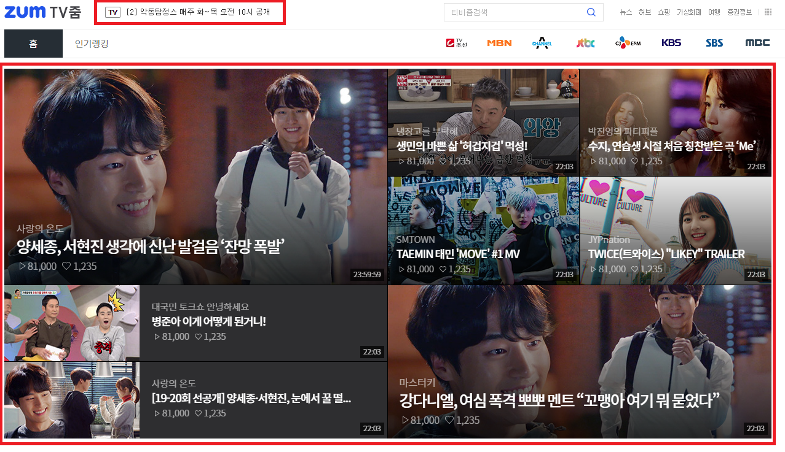

필수로 사용해야 하는 기술 스펙과 선택적으로 사용해도 좋은 기술 스펙도 전달받았습니다. Back-end 기술 스펙에는 그나마 공부해오던 것들이 있어서 모르던 것들을 학습하면서 진행하면 된다고 생각했지만, Front-end 기술 스펙에는 사용해보지 못한 것들이 대부분이었습니다. Webpack config 파일에 대한 울렁증도 있었고, 자바스크립트를 깊이 공부해본 적도 없으며, Vue.js라는 핫한 프론트엔드 프레임워크는 접해본 적도 없던 터라 이 부분에서 다가오는 벽이 가장 크게 느껴졌습니다.

| Back-end                                                     | Front-end                                                    |
| ------------------------------------------------------------ | ------------------------------------------------------------ |
| Spring Boot<br />Gradle<br />Java 8<br />JPA<br />Querydsl<br />Redis/Ehcache/Guava cache/Java Local cache (선택) | Freemarker<br />Webpack<br />Vue.js<br />Video.js<br />ES6 (선택)<br />+ Bootstrap4 |

## 2. 일정

기술적인 벽을 느꼈기 때문에 전략을 세울 수밖에 없었습니다. 요구사항에 명시된 기능 구현이라는 목적을 달성하기 위해서 Main 프로젝트를 계속해서 진행하되, 모르는 것들에 대한 학습과 Main 프로젝트에 적용할 서브 프로젝트들을 진행하면서 제가 느끼던 벽을 조금씩 허물기로 했습니다. 당연히 시간이 오래 걸릴 거라고 생각했고, 꽤 자주 제가 생각한 대로 진행되지 않아서 당황도 했습니다. 하지만 개인적으로 이 기간에 혼자서 전략도 세워보고, 일정도 관리해보고, 거기에 맞추려고 노력해봤던 것들이 분명 나중에 많은 도움이 될 것 같습니다.

### 2-1 프로젝트 진행 과정

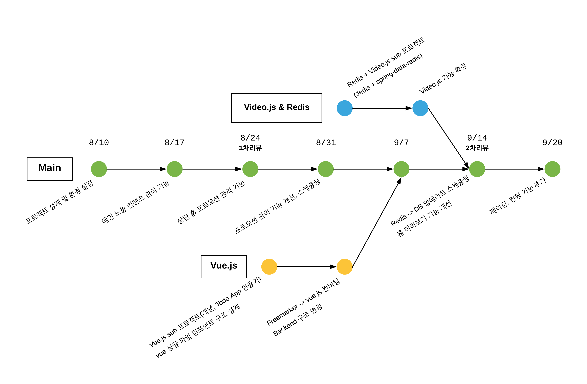

- 1주차 : 파일럿 프로젝트를 진행하기 위해 컨셉을 잡고, 설계 리뷰를 진행하면서 방향을 잡았습니다. 기능 구현을 위해서 화면에 대한 설계와 동작 시나리오, 데이터베이스 테이블과 구조에 대한 고민, 백엔드 비즈니스 로직의 흐름에 대한 고민을 가장 많이 했던 시간입니다.
- 2, 3주차 : 가장 중요한 필수 기능인 메인 상단 노출 컨텐츠 관리 기능과 상단 홈 프로모션 문구 관리에 집중했습니다. 이 기간에는 경험이 있는 Spring Boot + Freemarker로 기능 구현에 초점을 맞추고, 1차 리뷰 후에 진행할 Vue.js로의 전환을 위해서 Vue.js를 구성하는 중요한 요소들에 대해 학습했습니다.
  - [Vue.js 학습 내용 정리](https://github.com/namjunemy/TIL#vuejs)
- 4주차 : 1차 코드 리뷰가 끝나고 받은 수정 사항들을 반영하고, 내부적으로 문제가 있다고 느낀 프로모션 관리 기능을 수정했습니다. 그리고 3주차에 학습했던 Vue.js 개념을 바탕으로 서브 프로젝트 Todo 애플리케이션을 만들어 보면서 Vue가 화면을 동적으로 생성하는 법과 싱글 파일 컴포넌트 구조로 프로젝트를 구성하는 방법, Back-end와 어떻게 통신하고 데이터를 처리 하는지에 대해 알게 됐습니다.
  - [Vue,js Todo Application Project](https://github.com/namjunemy/vue-intermediate)
- 5주차 : Vue.js 서브 프로젝트를 진행하면서 학습한 것을 바탕으로 Freemarker로 구성된 화면 단을 Vue.js 싱글 파일 컴포넌트 구조로 변경했고, 이에 따라서 Back-end 구조도 수정 반영했습니다. 이 과정에서 Back-end 비즈니스 로직이 화면 단으로 많이 옮겨졌습니다. 추가로 또 하나의 서브 프로젝트를 진행했습니다. 선택 기능인 뷰페이지 미리보기(Video.js로 영상 컨트롤)을 구현하기 위해서 Video.js를 학습했고, 이 화면에서 영상의 재생수를 Redis로 관리하면 좋겠다고 생각해서 Jedis 라이브러리와 Spring-Data-Redis를 사용해서 기능을 구현했습니다.
- 6주차 : 영상 컨텐츠를 컨트롤하기 위해 Video.js 기능을 확장했고, 서브 프로젝트로 진행해 오던 것들을 메인 프로젝트에 적용했습니다. 그리고 레디스로 유지중이던 컨텐츠의 재생수를 주기적으로 DB에 업데이트하기 위해 Spring Scheduler에 대해서 학습했고, 스케줄링 기능을 구현했습니다.
- 7주차 : 2차 리뷰를 통해서 받았던 피드백을 바탕으로 코드 리팩토링을 진행했고, 사용자 경험을 개선하기 위해 등록된 컨텐츠, 프로모션들을 페이징하기 위한 기능과 노출예정인 컨텐츠, 프로모션 삭제 시 확인 절차를 거치는 기능을 추가 구현했습니다.

## 3. Database

### 3-1 테이블 구조

기존의 데이터를 바탕으로 서비스 하기 때문에 컨텐츠를 저장하는 테이블은 제가 직접 정의하거나, 변경할 수 없었습니다. 따라서, 홈 메인 상단 노출 컨텐츠 관리 기능을 구현하는 데 있어서 필요한 home_content 테이블을 별도로 정의하고 관리와 스케줄링, 히스토리 관리에 필요한 컬럼을 추가해서 사용했습니다. 그리고 재생수와 좋아요수는 실시간 변동이 잦기 때문에, 저장하는 테이블을 따로 관리해서 매번 컨텐츠의 모든 정보를 포함하는 테이블을 업데이트하는 부담을 줄이고자 했습니다. 따라서 평소에는 Redis로 데이터를 유지하고 스케줄링을 통해 Redis에 유지 중인 데이터를 DB에 업데이트하는 방식으로 재생수와 좋아요수를 관리합니다.

하지만 홈 상단 노출 프로모션 문구의 경우 CMS 사용자가 모든 부분(프로모션 문구 추가, 수정, 삭제, 스케줄링 등)을 직접 컨트롤하기 때문에, 하나의 테이블로 모든 것을 관리할 수 있다고 생각했습니다. 결과적으로 프로모션 문구와 해당 문구의 랜딩 URL, 노출 순서, 스케줄링 시간과 최종 수정자를 포함하는 home_promotion 하나의 테이블을 사용하여 기능 구현이 가능했습니다.

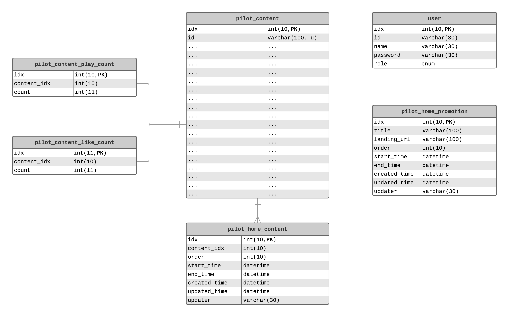

## 4. Frontend

### 4-1 화면 설명

화면의 구성은 기본적으로 Navbar와 CMS 기능 선택을 위한 Sidebar가 위치하고, 기능을 선택할 때마다 해당 기능을 사용하기 위한 화면 컴포넌트가 동적으로 렌더링 됩니다. 프로젝트의 초점이 기능 구현에 맞춰져 있었기 때문에, Bootstrap-Vue 라이브러리를 이용하여 화면의 그리드 시스템과 디자인을 적용했습니다.

예를 들면, 화면에서 노출 프로모션 문구 관리 기능을 사용하는 CMS 담당자는 노출하기 위한 프로모션 문구를 추가하고, 노출 순서에 맞게 프로모션 문구의 롤링이 이루어지는지 홈 미리 보기 기능을 통해 확인할 수 있습니다. 확인 후에, 원하는 스케줄링 시간을 선택하고 저장하면, 오른쪽 화면의 등록된 프로모션 리스트에 동적으로 반영됩니다.

뒤에서 자세히 설명드리겠지만, Freemarker 템플릿 엔진으로 렌더링하는 화면과 싱글 파일 컴포넌트 구조의 Vue.js로 그리는 화면은 겉으로 보기에 차이가 없습니다. 하지만, 이렇게 화면 요소를 동적으로 처리해야하는 부분들을 구현하는데 있어 Freemarker로 서버사이드 렌더링을 할 때보다 Vue.js 적용 후에 더 효율적으로 구현할 수 있었습니다.

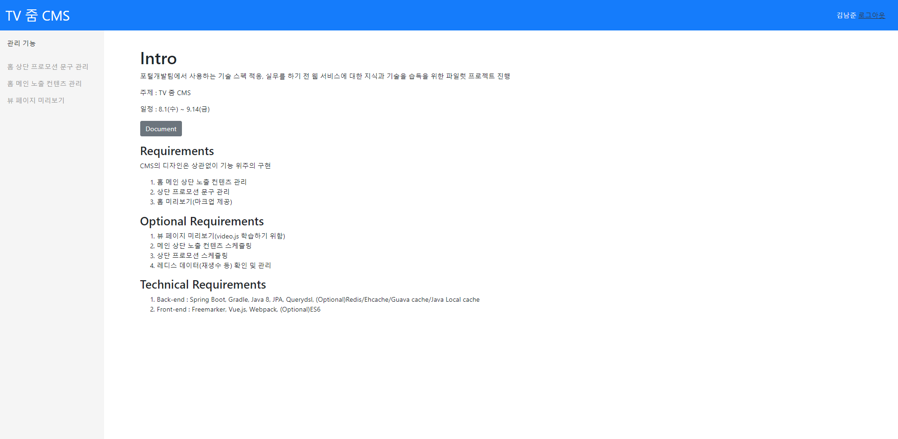

### 4-2 구조 변경(Freemarker -> Vue.js)

파일럿 프로젝트를 하면서 가장 많은 코드의 변경과 프로젝트 구조의 변경이 일어났던 시점은 Freemarker로 구현된 화면 단을 Vue.js로 컨버팅 하는 서브 프로젝트를 진행할 때였습니다. 프론트엔드 프로젝트를 독립적으로 분리하는 과정을 거치면서 아래와 같은 장점들을 가져갈 수 있었습니다.

* Bootstrap, Bootstrap-datetimepicker 등 gradle과 static으로 관리하던 프론트엔드 의존 라이브러리들을 독립적으로 프론트엔드 프로젝트의 package.json 파일에서 관리할 수 있게 됐습니다.
* 템플릿 엔진으로 중복 렌더링하던 공통요소(header.ftl, footer.ftl, navigation.ftl 등)를 Vue의 컴포넌트로 만들어서 화면의 변경이 없다면 초기에 한번만 렌더링 합니다.
* 기능별로 있던 `.ftl` 파일과 동작을 위한 코드가 있던 `.js` 파일의 내용이 하나의 `.vue` 파일로 관리되면서 Vue.js의 싱글 파일 컴포넌트 구조로 변경되었고, 덕분에 하나의 파일에서 html 코드와 js 코드를 관리할 수 있습니다.
* 프론트엔드 프로젝트와 백엔드 프로젝트가 분리되면서 webpack-dev 서버를 통해서 별도로 프론트엔드 프로젝트를 구동시키기 때문에, 코드의 수정이 있어도 스프링 부트 프로젝트를 re-run 하지 않아도 돼서 개발 생산성이 매우 좋아졌습니다.

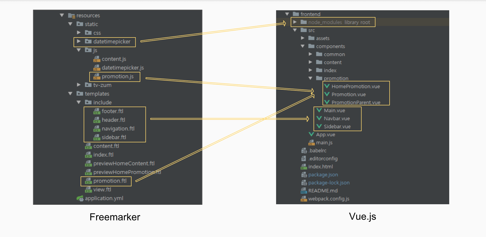

### 4-3 Single File Component 구조로 변경된 화면

싱글 파일 컴포넌트 구조로 변경된 후의 화면 구성입니다. 크롬의 Vue Devtools를 도움을 받으면 Vue.js의 컴포넌트 구조를 브라우저에서 확인할 수 있습니다. Root 아래에 Vue가 렌더링을 시작하는 엔트리 포인트인 App 컴포넌트가 존재합니다. 그 아래에 Navbar와 Sidebar, Main 3개의 컴포넌트가 동일 레벨에서 렌더링 됩니다.

Main 컴포넌트에는 컴포넌트의 전환을 위해서 라우터가 등록되어 있고, 사용자의 선택에 따라서 해당 컴포넌트가 Main 컴포넌트 아래에 동적으로 그려집니다. Main 컴포넌트 아래에 다시 2개의 Child 컴포넌트로 나누어지고, 필요하다면 컴포넌트 간 통신으로 데이터를 주고받습니다.

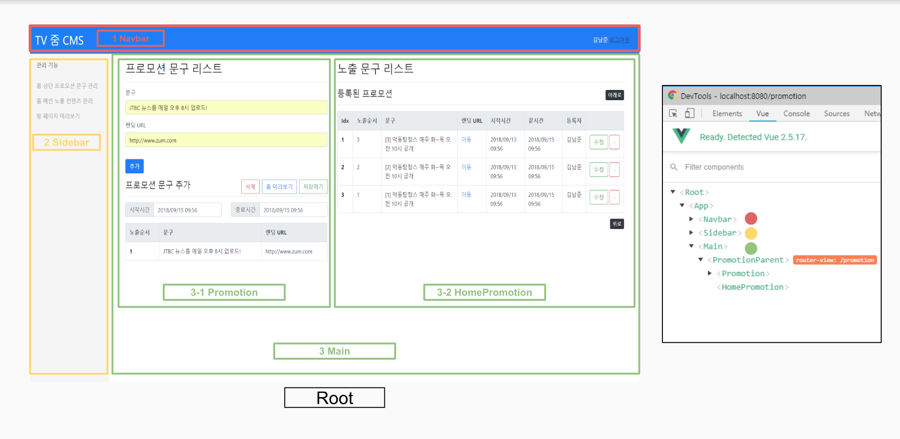

프론트엔드 프로젝트의 컴포넌트 트리 구조입니다. 위에서 설명 드린 대로 Root 아래의 동일 레벨에서 3개의 컴포넌트가 렌더링 되고, Main 컴포넌트에 정의된 router에 의해서 사용자의 실질적인 작업 화면이 동적 렌더링 됩니다. 싱글 파일 컴포넌트 구조의 또 하나의 장점은 해당 컴포넌트에서 필요한 `html`, `css`, `js` 코드를 하나의 `.vue` 파일에서 관리할 수 있다는 것입니다.

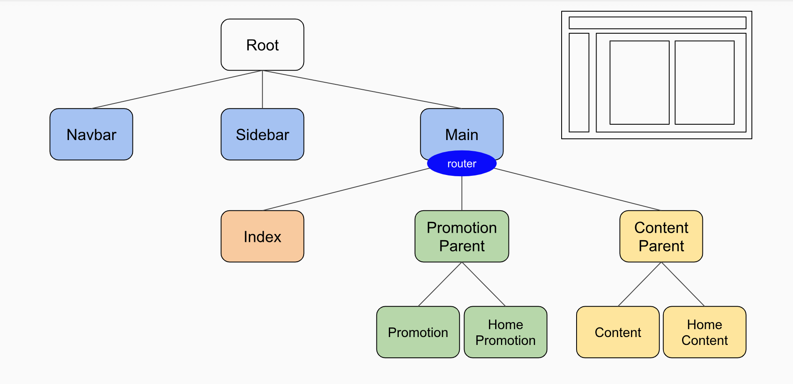

### 4-4 Component의 Parent-Child 통신과 데이터 바인딩

Main 컴포넌트 아래에서 다시 Parent-Child로 구성되는 컴포넌트 구조를 가져가면서, 불가피하게 Child 컴포넌트 간 통신이 필요한 상황이 생겼습니다. 아래에 있는 홈 메인 상단 노출 컨텐츠 관리 화면에서 사용자는 Content Parent 컴포넌트의 왼쪽 Child인 Content 컴포넌트에서 노출하고자 하는 컨텐츠를 추가하고, 해당 컨텐츠는 Parent 컴포넌트의 오른쪽 Child인 HomeContent 컴포넌트의 리스트에 동적으로 추가되어야 하는 상황을 예로 들 수 있습니다.

하지만, Vue.js는 기본적으로 동일 레벨에 있는 컴포넌트 간 직접 통신이 불가능하게 되어있습니다. 모든 컴포넌트는 각 컴포넌트 자체의 스코프를 가지며, 하위 컴포넌트가 상위 컴포넌트의 값을 바로 참조할 수 없습니다. 대신에 같은 레벨에 있는 컴포넌트 간 통신을 위해서 Parent-Child 컴포넌트 통신의 개념으로 Events up, Props down이 존재합니다.

* Events up : Child -> Parent 요청
* Props down : Parent -> Child 전달

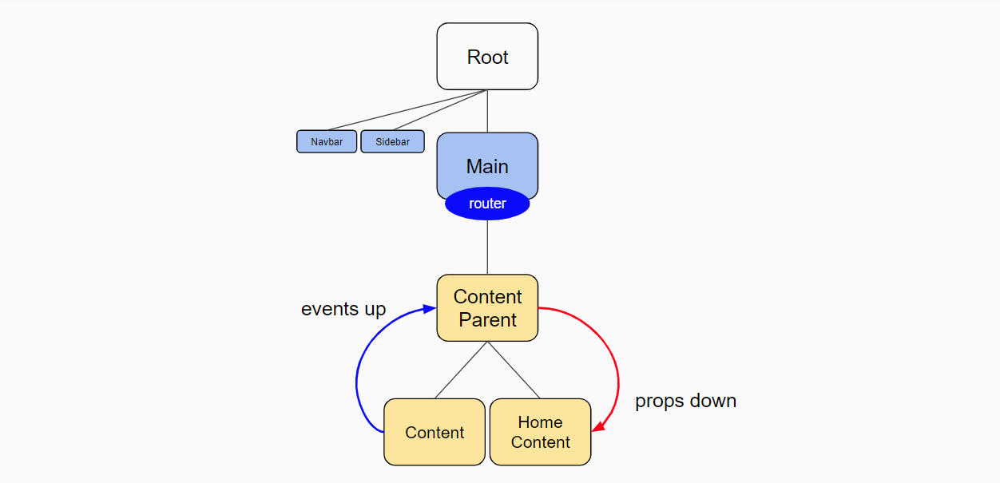

통신에서 Parent를 거쳐야 하는 것이 처음에 개념을 학습할 때는 불편할 수 있겠다고 생각했었지만, 실제 코드로 작성하면서 이 통신 방식의 장점을 느낄 수 있었습니다.

Parent의 왼쪽 Child인 Content 컴포넌트에서 Events up으로 요청과 함께 파라미터들을 넘겨줄 수 있습니다. 그러면 Parent 에서는 `v-on` 이라는 Vue.js의 디렉티브를 이용해서 해당 요청을 처리할 수 있게 됩니다. 실제로 요청을 받아서 실행되는 Parent 컴포넌트의 toggleCheck 함수에서는 오른쪽 Child인 HomeCotent 컴포넌트로 넘겨주기 위한 selectedList 등을 가공하는 비즈니스 로직이 수행되겠죠? 그 작업이 끝나고 나면 HomeContent 컴포넌트에서는 Parent로부터 Props down을 통해 내려받은 데이터들을 사용해서 화면을 동적으로 그려낼 수 있게 됩니다.

이벤트의 요청/응답의 범위가 Parent-Child 컴포넌트로 한정되고, 요청/응답의 주체를 명확하게 확인할 수 있습니다. 또한, Child 컴포넌트에서는 이벤트를 요청하거나 props 데이터를 사용하기만 하면 되고, 핵심 비즈니스 로직과 공통으로 사용하는 데이터들은 전부 Parent 컴포넌트에서 관리할 수 있습니다.

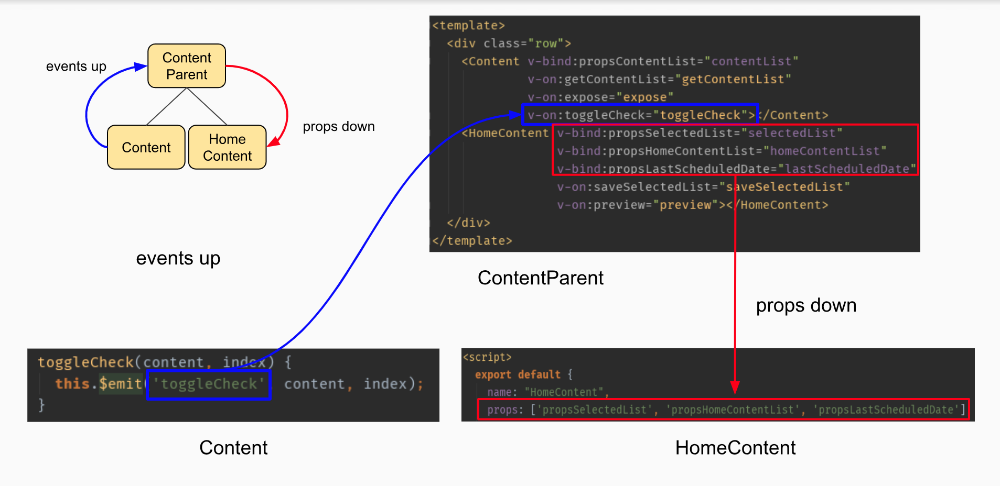

## 5. Backend

### 5-1. Backend 요청/응답 흐름

사용자는 Vue.js로 렌더링 된 화면을 통해서 Backend로 요청을 보내게 됩니다. Spring Boot 2.0.4를 기반으로 Controller-Service-Repository 레이어 형태의 일반적인 구조와 spring-data-jpa를 사용했습니다. 마크업을 제공받아서 구현하는 미리보기 화면은 Freemarker로 서버사이드 렌더링을 하고, 뷰페이지 미리보기 화면(Video.js로 영상 컨텐츠 컨트롤)과 같이 구현한 재생수 관리 기능의 경우 Java에서 Redis를 사용하기 위한 Jedis 라이브러리와 spring-data-redis를 이용하여 redis에 저장되어있는 데이터를 조회하고 수정합니다.

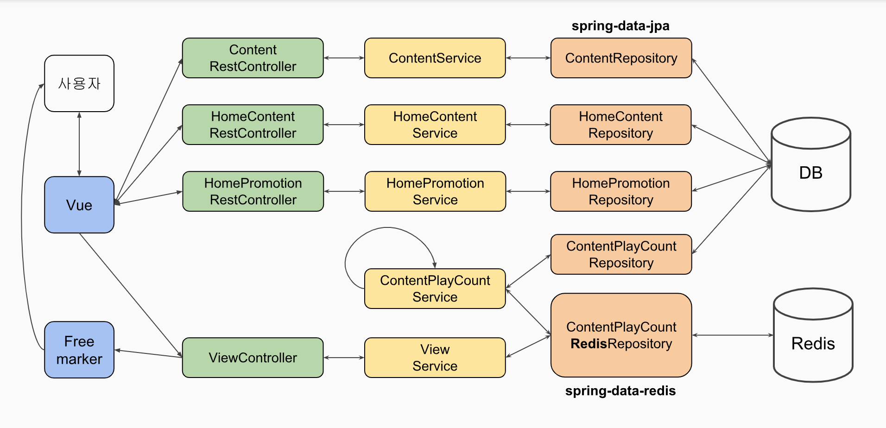

### 5-2. Spring Scheduler로 Redis데이터 DB에 업데이트 하기

앞서 말씀드렸듯이 재생수와 좋아요수는 실시간 변동이 잦기 때문에, 저장하는 테이블을 따로 관리해서 매번 컨텐츠의 모든 정보를 포함하는 테이블을 업데이트하는 부담을 줄이고자 했습니다. 따라서 평소에는 Redis로 데이터를 유지하고 스케줄링을 통해 Redis에 유지중인 데이터를 DB에 업데이트하는 방식으로 재생수와 좋아요수를 관리합니다.

아래의 코드처럼 스케줄링할 Task를 정의하고, @Scheduled 애노테이션을 사용해서 주기적으로 ContentPlayCountService 클래스에 정의된 updateAll 함수를 호출합니다.

여기서 `appProperty.getScheduleConf().getIsSchedulingServer()` 메서드의 리턴 값을 판단하는 이유는 서비스하고 있는 모든 서버에서 스케줄링이 일어날 필요가 없기 때문입니다. 따라서, 서비스 중인 여러 대의 서버 중 application.yml에 설정된 isSchedulingServer의 값이 true(default=false)일 경우에만 스케줄링이 이루어집니다.

```java
@RequiredArgsConstructor
@Component
@EnableConfigurationProperties(AppProperty.class)
public class ScheduleTasks {

  private final AppProperty appProperty;
  private final ContentPlayCountService contentPlayCountService;

  private static final Logger logger = LoggerFactory.getLogger(ScheduleTasks.class);

  @Scheduled(cron = "0 */1 * * * *")
  public void updateRedisToDatabase() {
    if (appProperty.getScheduleConf().getIsSchedulingServer()) {
      logger.info("재생 수 Redis -> DB UPDATE 수행",
          DateTimeFormatUtils.ofYYYYMMddHHmmss(LocalDateTime.now()));
      contentPlayCountService.updateAll();
    }
  }
}
```

실제로 아래의 그림과 같이 스케줄링이 동작합니다. 정의된 스케줄링 Task가 수행될 때, spring-data-redis의 도움을 받아 Redis에서 조회한 데이터를 주기적으로 Database에 업데이트합니다.

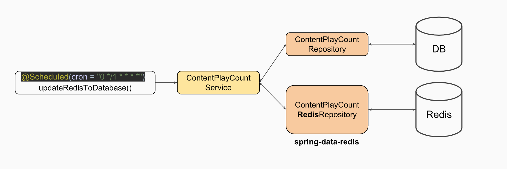

### 5-3. @ConfigurationProperties로 설정값 관리하기

그동안 프로퍼티 값을 주입하기 위해서 @Value를 사용했었습니다. 파일럿 프로젝트를 하면서 프로퍼티 정보를 Bean으로 관리할 수 있다는 것을 알았습니다. 아래의 코드에서 처럼 @ConfigurationProperties를 이용해서 application.yml 파일 안에 app이라는 prefix를 가진 프로퍼티 값들을 주입할 수 있습니다. 실제로 AppProperty 클래스에서 Redis의 접속 정보와 스케줄링 서버를 판단하는 값을 관리하고 있습니다.

```java
@Getter
@Setter
@Component
@NoArgsConstructor
@ConfigurationProperties(prefix = "app")
@Validated
public class AppProperty {

  @Valid
  private RedisConf redisConf;

  @Valid
  private ScheduleConf scheduleConf;

  @Getter
  @Setter
  @NoArgsConstructor
  public static class RedisConf {

    @NotBlank
    @Size(max = 15)
    private String host;

    @NotNull
    private int port;

    @NotBlank
    private String password;
  }

  @Getter
  @Setter
  @NoArgsConstructor
  public static class ScheduleConf {

    private Boolean isSchedulingServer = false;
  }
}
```

* application.yml

```yml
...
app:
  redisConf:
    host: 127.0.0.1
    port: 6379
    password: password

  scheduleConf:
    isSchedulingServer: true
...
```

## 6. 마치며

> 줌인터넷 포털개발팀에서의 파일럿 프로젝트가 무사히 끝나고 실무를 하게 되는 시점에서 드는 솔직한 생각입니다.
>
> 처음에는 맨몸으로 들어온 초보자에게 '여기 무기, 갑옷 있으니까 알아서 입고 나와'라고 하는 것 같았습니다. 초보자의 원래 스타일을 확인하기 위함이었겠죠? 근데 중간 중간 리뷰를 거치면서 팀원 분들이 '그 자세에서는 무기 이렇게 잡는 건 어때? 이렇게 찌르는 게 편하지 않아?'라는 식의 조언을 해주셨습니다. 그것들을 받아들이고 적응하는 과정을 거치면서 저에게 포털개발팀의 팀 컬러가 조금씩 입혀졌다고 생각합니다. 혹시 제가 비유를 어렵게 하고 있나요..?
>
> 정리하자면 파일럿 프로젝트의 전과 후 저의 모습에는 많은 변화가 있었습니다. 조금은 특별한 느낌의 성장을 경험했다고 하면 맞을 것 같네요. 회사와 저 모두에게 유익한 시간이었을 것이라고 생각합니다. 긴 글 읽어주셔서 감사합니다:)

